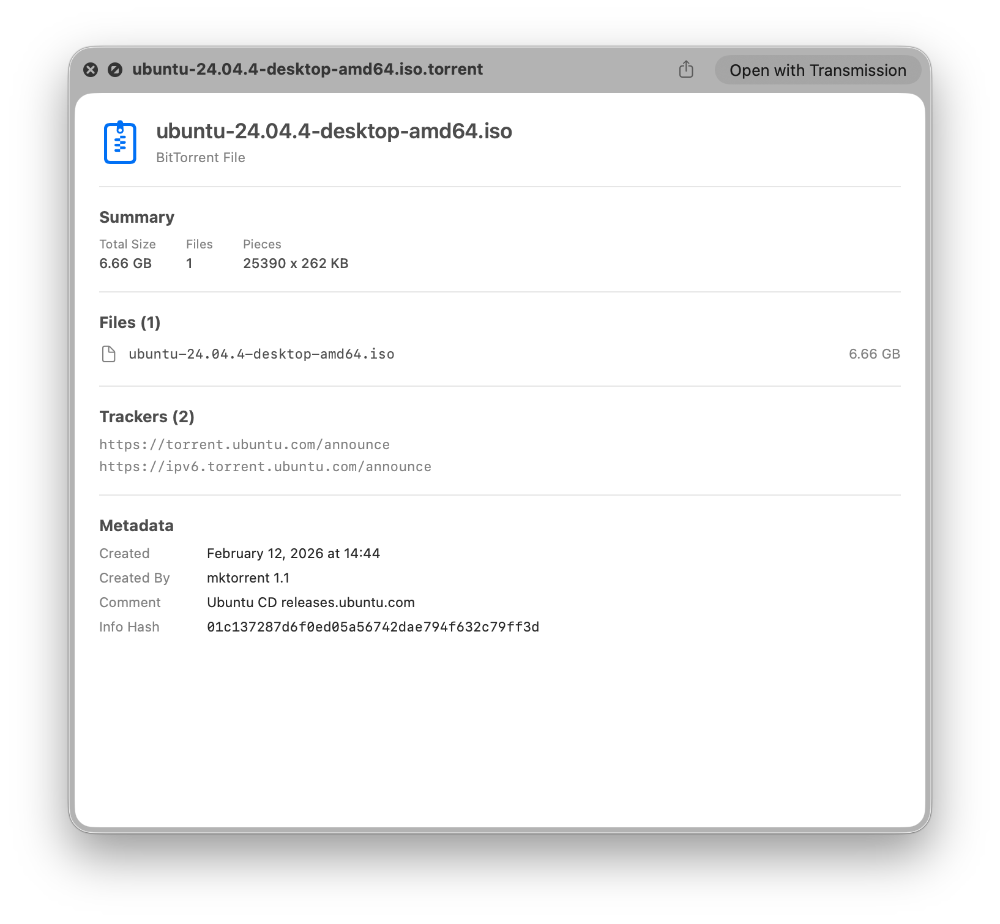

# Torrent Preview

A macOS QuickLook extension for previewing `.torrent` files. Select a torrent file in Finder and press Space to see its contents at a glance.



## Features

- File list with sizes and type-specific icons
- Total size, file count, and piece info
- Tracker list
- Metadata: creation date, creator, comments, info hash
- Private torrent indicator
- Handles both single-file and multi-file torrents

## Requirements

- macOS 13.0 or later

## Installation

### Download

1. Download the latest release from the [Releases](../../releases) page
2. Move **Torrent Preview.app** to your Applications folder
3. Launch the app once to register the extension
4. Select any `.torrent` file in Finder and press Space

### Build from Source

1. Clone the repository
2. Open `TorrentPreview.xcodeproj` in Xcode
3. Build and run (Cmd+R)

### Troubleshooting

If previews don't appear after installation, reset QuickLook in Terminal:

```
qlmanage -r
```

## License

MIT License. See [LICENSE](LICENSE) for details.

Buy me a coffee - https://ko-fi.com/sveinbjornp
